**SENG 637 - Dependability and Reliability of Software Systems**

**Lab. Report \#5 – Software Reliability Assessment**

| Group   :      |              26             |
| -------------- | ----------------------------|
| Student Names: |          Yash Soni          |
|                |  Vrunda Yogeshbhai Adhvaryu |
|                |       Vaishnavi Palla       |

# Introduction
 In this assignment we are analyzing Reliability Growth Testing and Reliability Demonstration Chart to see the growth and Reliability of the software during and after the release.
More details are shared in following sections of this report. In this report we are attaching test results in form of screen-shots and discussion and comparison on them is done.

# Assessment Using Reliability Growth Testing 
In general, the first prototypes produced during the development of a new complex system will contain design, manufacturing and/or engineering deficiencies. Because of these deficiencies the initial reliability of the prototypes may be below the system's reliability goal or requirement. In order to identify and correct these deficiencies, the prototypes are often subjected to a rigorous testing program. During testing, problem areas are identified, and appropriate corrective actions (or redesign) are taken. Reliability growth is the improvement in the reliability of a product (component, subsystem or system) over a period of time due to changes in the product's design and/or the manufacturing process.
Reliability growth is related to factors such as the management strategy toward taking corrective actions, effectiveness of the fixes, reliability requirements, the initial reliability level, reliability funding and competitive factors. For example, one management team may take corrective actions for 90% of the failures seen during testing, while another management team with the same design and test information may take corrective actions on only 65% of the failures seen during testing. Different management strategies may attain different reliability values with the same basic design. The effectiveness of the corrective actions is also relative when compared to the initial reliability at the beginning of testing. If corrective actions give a 400% improvement in reliability for equipment that initially had one tenth of the reliability goal, this is not as significant as a 50% improvement in reliability if the system initially had one half the reliability goal.
ELEMENTS OF A RELIABILITY GROWTH PROGRAM
• Management strategy
• Testing 
• Failure mode root cause identification
• Corrective action effectiveness
RELIABILITY GROWTH ANALYSIS
Reliability growth analysis is the process of collecting, modelling, analysing and interpreting data from the reliability growth development test program (development testing). In addition, reliability growth analysis can be done for data collected from the field (fielded systems).
For the testing we have used SRTAT provided in the artifacts as CASRE has not worked in either of ours computer.

Reference:
https://www.weibull.com/basics/growth.htm
# RGT Test results
Test-1)
 jelinski -> least square method ->

 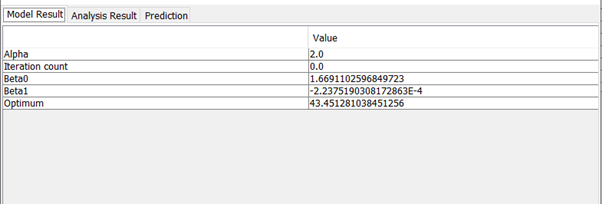
 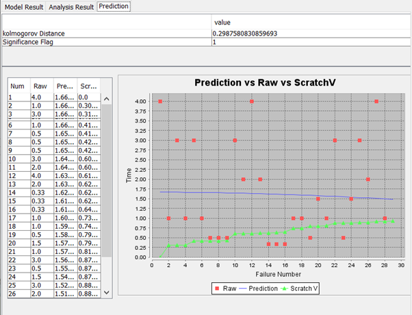

 Test-2) 
 Littlewood

 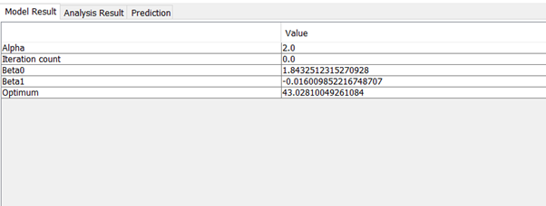
 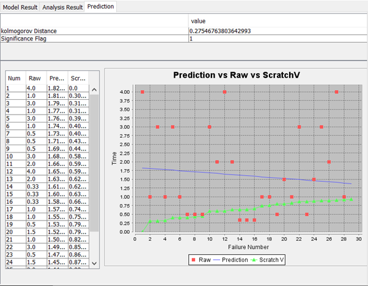

 Test-3)
 John Musa's basic computation

 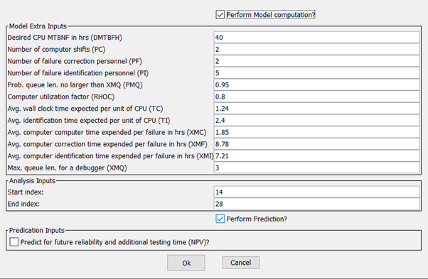
 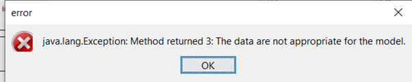

 Test-4)
On data-idf , Brook’s & Motley models
Left image: with perform model computation 
Right image: w/o perform model computation

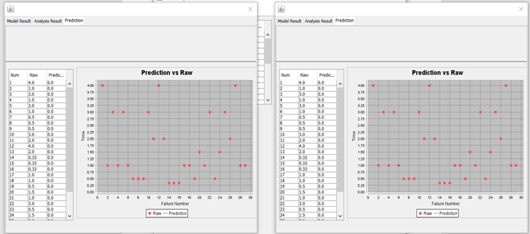

Test-5)
Model: generalized poisson
Results: no proper results found for this model

Test-6)
Model: Non-homogeneous poisson

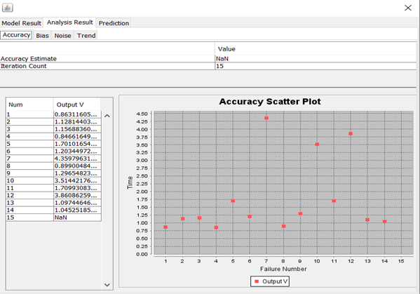
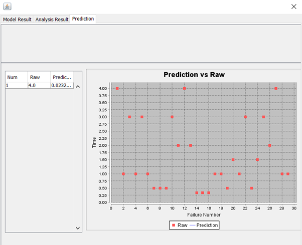

Test-7)
Method: Yamada’s S-shaped Reliability

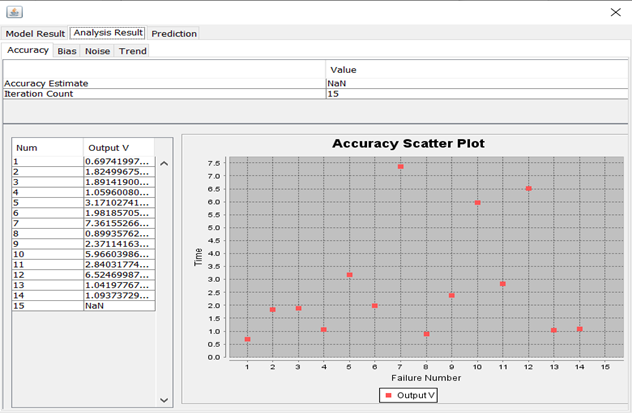

Test-8):
On Data-idf
Model: Geometric

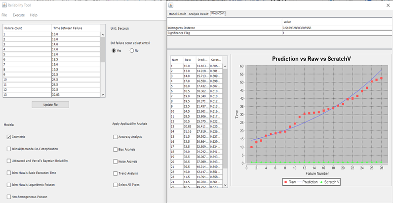

Test-9):
On Data-idf
Model: Littlewood: maximum likelihood method

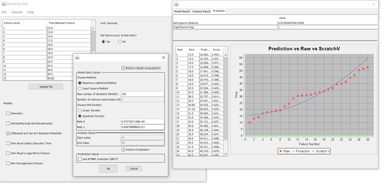

Test-10):
On Data-tbf
Model: Littlewood: least-squares method

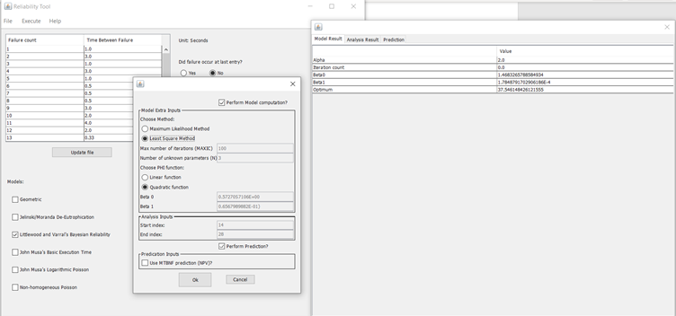

# Assessment Using Reliability Demonstration Chart 
Reliability Demonstration Chart (RDC) is one of the popular ways to assess the reliability of a system under test. RDC is an effective source to figure out whether the target failure rate known as MTTF (Mean Time to Failure) has been acquired or not for a particular system. For formulating this chart, the tool uses failure data of the system collected over time in two formats: time between failure and failure counts.
For this assignment, we have used the SRTAT tool to develop the RDC for the failure data provided to us in both the formats mentioned above. Additionally, we have used the failure counts data to produce the RDC.
The failure counts data when loaded into the tool looks like the figure below where the first column indicates the failure number, second column indicates time since previous failure, third column indicated the cumulative time, and fourth column indicates the severity level:

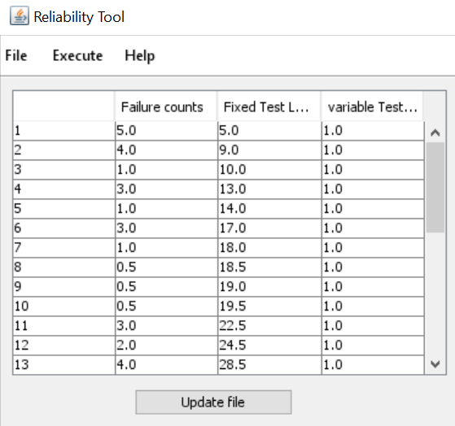

Looking at the data and experimenting with multiple “what-if” scenarios, we plotted a number of RDCs by changing the the values of MTTF. After careful observation, we came to a conclusion of keeping the MTTFmin to be 0.5, i.e., 0.5 failures per second. It was also observed that by decreasing the value of descrimination ratio (Ⲩ) the continue region became wider, meaning more testing is required to reach the accept/reject region. Similarly, increasing the consumer risk (β) and developer risk (α) values made the continue region wider leading to more testing required to reach accept/reject region. Evaluating this, we decided to keep these three values default: Ⲩ=2, β=0.1%, α=0.1%.

RDC for MTTFmin = 0.5

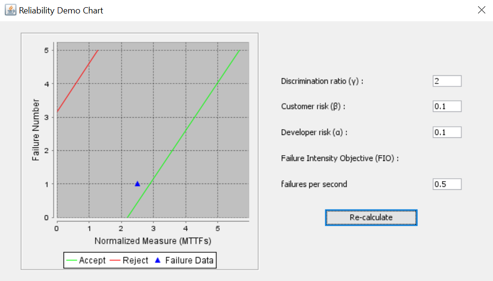

The failure data is seen in the continue region but closer the the accept region, and if the next data points are plotted in the graph, it shows that the system has moved into the acceptable region for failure tolerance.

RDC for half MTTFmin = 0.25

The failure data now, is still in the continue region, further from the accept line, meaning more tests are required to determine the acceptance/rejection of the system. Plotting further data points indicate that the system slowly moves into the accept region.

RDC for double MTTFmin = 1.0

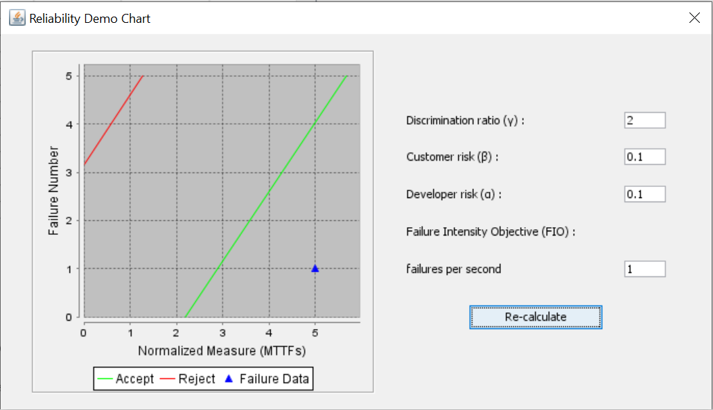

The failure data already is in the acceptable region when doubling the MTTF value. As first failure occurs at 5 normalized MTTF. Hence, doubling the MTTF increases the acceptability of the system under reliability assessment.
Advantages and Disadvantages of RDC
An RDC is ususally used when we have limited number of failure data available with us along with the times of failure are known, which provides us with the trend of the reliability of the system being assessed. One major benefit of RDC analysis is that it is very versatile way on analysing the reliability of a system providing information whether the system is reliable in terms of time and cost. A number of iterations can be done by changing the confidence levels and MTTFs of the system as and when the system is updated ot new failure data is introduced helping in “what-if: scenarios.
However, the drawback of RDC is that it is unable to provide us with a perfect quantitative value of reliability or availability of the system under review as it can only indicate whether the system is acceptable or not.

# Comparison of Results
In reliability growth testing, significance flag values are used to determine the goodness of fit of the models or Model Rank. Below are the respective significant flag values of models used during testing.

•	Geometric Model has a significance value of 1, when tested on ‘data-ida’ failure data.
•	Littlewood Model has a significance value of 2, when tested on ‘data-tbf’ failure data.
•	Littlewood Model (least-square method) has a significance value of 1, when tested on ‘data-tbf’ failure data.
•	Littlewood Model (maximum likelihood method) has a significance value of 1, when tested on ‘data-ida’ failure data.
•	Jelinski Model has a significance value of 1, when tested on ‘data-tbf’ failure data.

From above values, we can guess that the best models are:
•	For ‘data-ida’ dataset, best models would be Geometric or Littlewood Model (using maximum likelihood Method).
•	For ‘data-tbf’ dataset, would be Littlewood Model (using Least-squares method), Jelinski.

In RDC we can get appropriate results by making different MTTF values and see which on suits to our desired results and we can see from above discussion that the failure are in already a considerable or staedy state. BY doubling the MTTF value we can confirm that the system under reliability assessment move forward to better/acceptable failure results.

# Discussion on Similarity and Differences of the Two Techniques

RGT is performed to assess current reliability, identity and forecast future reliability. The results/figures are compared with intermediate reliability objectives to measure progress so that resources can be directed to achieve the goals and targets effectively. if a failure occurs, approproate measures must be taken to remove the cause.
Foe hardware it RGT is the process of testing in natural as well as induced environment to find out failures.

on the other hand RDC is to assess the end of the growth testing to verify that a specific reliability level has been achieved or not. During RDC test, the S/W code is frozen.

Both the tests must be performed under same condition that is the environment in which the s/w executes must emulate what the s/w will be doing in real environmental conditions.

Source:https://www.cs.colostate.edu/~cs530/rh/section8.pdf
# How the team work/effort was divided and managed
For this assignment we equally divided among all the team members and checked the results with each other to see the analysis. Also, we attached the best results out of all the results to understand this assignment. We discussed the results among each other and understood the difference and WHYs of the results. So, this time too we equally divided the task for the completion of the assignment.

# Difficulties encountered, challenges overcome, and lessons learned
The most difficult task was to set-up CASRE that none of us could figure out. The reason we found that it is not compatible with latest windows OS. Initially we were not able to understand the purpose of the assignment and how to do that but as we kept working on that we understood the process and results.
Other than that, we have had great experience working this assignment

# Comments/feedback on the lab itself
* The lab was a great introduction Reliability testing through growth testing and demonstration chart and was designed with consideration for beginners in mind, which we  think, is amazing, as we had no prior experience.
*  Also for RGT & RDC testing the documentation was very descriptive enough and we had a great experience working with SRTAT. the only complain is that it would be very helpful if it was mentioned that how we are to compair 2 results or methods as they both are different from each other and we got confused so did as per our understanding.
*  Overall lab documents were skillfully made. They were very detailed with clear steps and no ambiguous statements whatsoever. We were able to do most of the assignment just by following the document.
*  The lab completely justified what it was designed for and it gave a good sense of how unit testing is done, planned and provide a practical understanding of the concepts learnt till now.